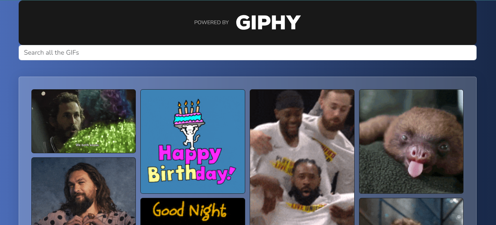

# Electiva 1
## Main developer
- [Johan Alexander Rojas Suárez](https://github.com/joh4n-Geek)
- 
## Technology
- React

# Jiphy App
This is an academic project to develop a gift search app using React and Giphy API. Find gifts based on preferences and interests.

## Preview

## How to run the project
1. Clone repo (https://github.com/joh4n-Geek/Electiva1JohanRojas.git)
2. Open with VS Code
3. Run command npm i to install dependencies
4. Run command npm start
5. Enjoy!